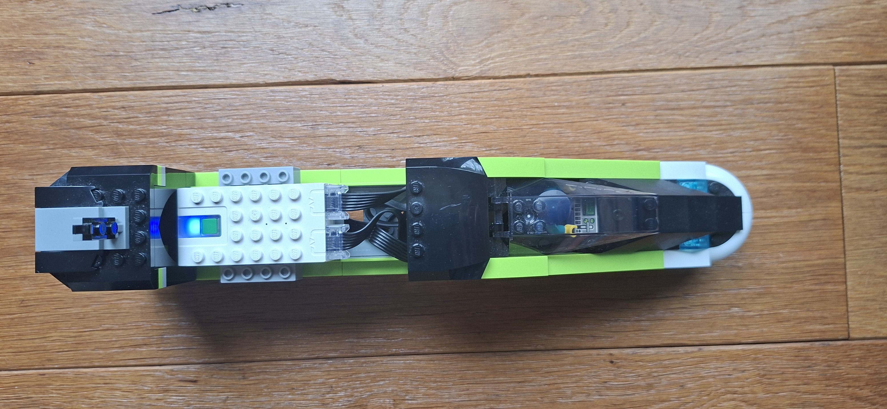
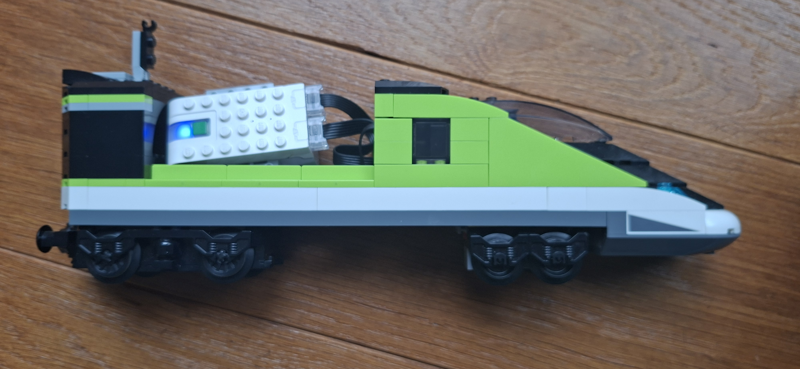
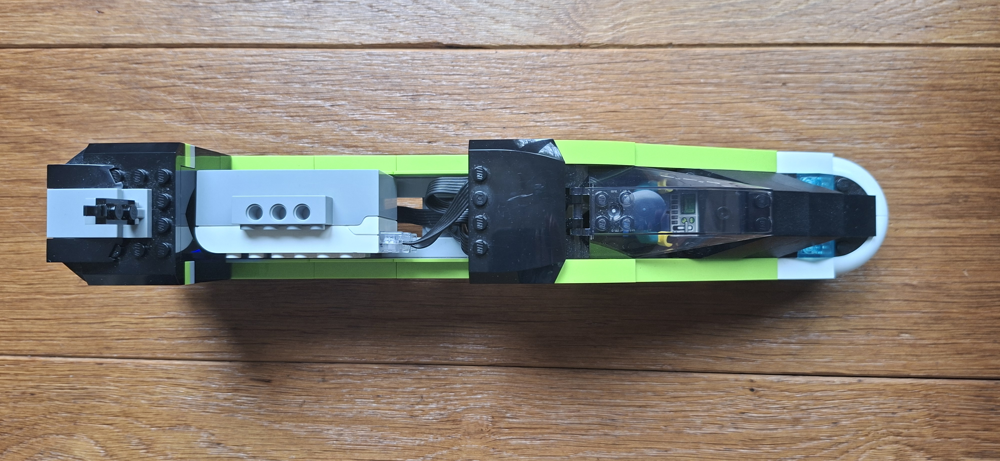
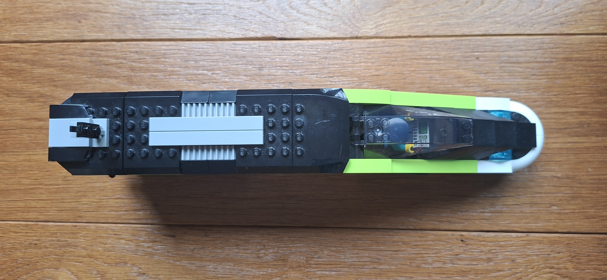
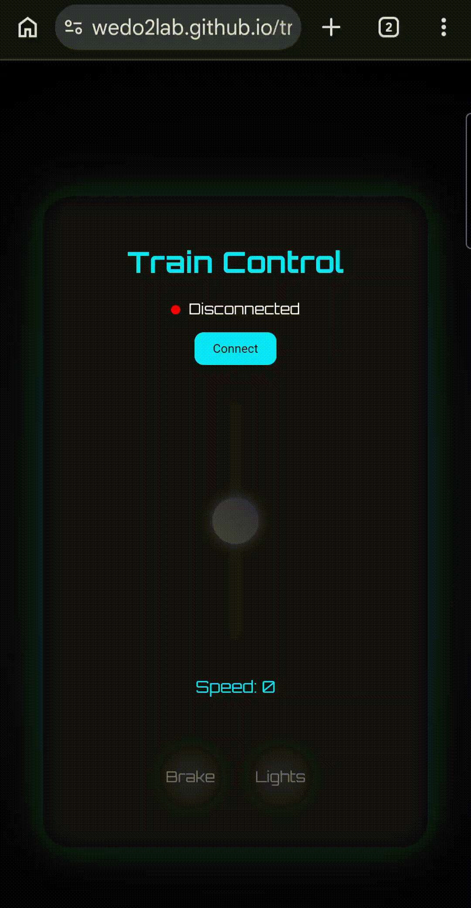

# Train Controller (Lego WeDo 2.0)

A browser-based controller for LEGO WeDo 2.0 using the Web Bluetooth API. Control a motorized train with a throttle lever, brake, and lights in real time.

---

## Features

- Bluetooth connection to WeDo 2.0 hub  
- Speed control (-100 to +100)  
- Brake (instant stop)  
- Light toggle  
- Mouse, touch, and keyboard input  

---

## Requirements

- Google Chrome (desktop or Android) (other browsers are not supported)
- LEGO WeDo 2.0 Smart Hub #19071 (no longer for sale on LEGO.com)
- LEGO Train Motor [#88011](https://www.lego.com/en-us/product/train-motor-88011)
- LEGO Light [#88005](https://www.lego.com/en-us/product/light-88005) (optional)
- I used LEGO [#60337](https://www.lego.com/en-us/product/express-passenger-train-60337) for the train and put the wedo2 hub on it, but you can also build your own or use a different train set.

    

---

## Usage

1. Open https://wedo2lab.github.io/traincontroller in Google Chrome
2. Click **Connect**
3. Select your WeDo hub
4. Control the train using the lever or keys

### Controls

#### Mouse/Touch Controls

#### Keyboard Controls
| Key | Action |
|-----|--------|
| W / ↑ | Increase speed |
| S / ↓ | Decrease speed |
| Space | Brake |
| L | Toggle lights |

---

## License

MIT
